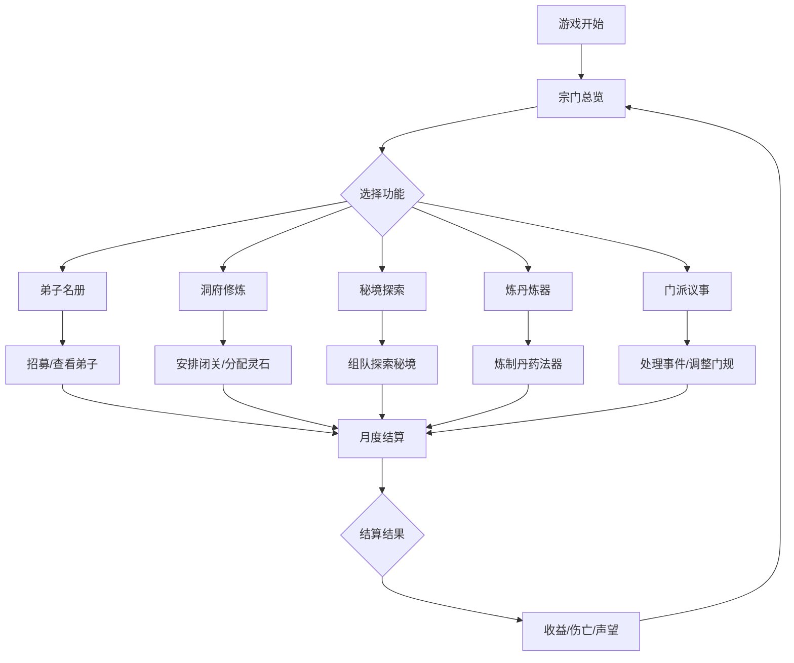

## 1. 产品概述

AI 修仙宗门经营游戏——玩家扮演宗主，管理由不同 AI 弟子组成的小宗门，在修仙世界中壮大势力。通过招募弟子、分配资源、安排修炼与历练、炼丹炼器、探索秘境、处理门派事务等手段，体验修仙世界的经营与抉择。

- 面向喜欢修仙题材与经营模拟的玩家
- 核心价值：AI 弟子自主行为与互动带来的涌现式叙事体验

## 2. 核心功能

### 2.1 用户角色

| 角色 | 说明 | 核心权限 |
|------|------|----------|
| 宗主（玩家） | 唯一操控者 | 管理宗门一切事务、分配资源、做出决策 |
| AI 弟子 | 自动行为 | 根据性格与灵根自动修炼、对话、争执、历练 |

### 2.2 功能模块

1. **宗门总览**：宗门核心数据面板、月度收益、声望变化趋势、当前事件通知
2. **弟子名册**：弟子列表、灵根/性格/境界详情、招募新弟子、弟子关系图谱
3. **洞府修炼**：安排弟子闭关、查看修炼进度、境界突破概率、修炼资源分配
4. **秘境探索**：秘境列表与难度、组队派遣、探索进度与战利品、伤亡报告
5. **炼丹炼器**：丹方与图纸管理、材料库存、炼制操作与成功率、成品管理
6. **门派议事**：弟子对话与争执事件、门规倾向调整、随机事件处理、势力关系

### 2.3 页面详情

| 页面名称 | 模块名称 | 功能描述 |
|----------|----------|----------|
| 宗门总览 | 核心指标面板 | 显示灵石库存、弟子总数、宗门声望、当前月份 |
| 宗门总览 | 收益趋势图 | 月度灵石收入与支出折线图 |
| 宗门总览 | 事件通知栏 | 展示近期门派事件与弟子动态 |
| 宗门总览 | 快捷操作区 | 一键进入各功能模块 |
| 弟子名册 | 弟子列表 | 卡片式展示所有弟子，含头像、名字、境界、灵根 |
| 弟子名册 | 弟子详情 | 查看灵根属性、性格特征、修为进度、人际关系 |
| 弟子名册 | 招募弟子 | 消耗灵石招募新弟子，随机生成灵根与性格 |
| 弟子名册 | 弟子关系 | 展示弟子间的好感/敌对关系 |
| 洞府修炼 | 修炼位管理 | 查看洞府修炼位占用情况，安排弟子闭关 |
| 洞府修炼 | 修炼进度 | 实时显示闭关弟子修炼进度与突破概率 |
| 洞府修炼 | 资源分配 | 为闭关弟子分配灵石加速修炼 |
| 秘境探索 | 秘境列表 | 展示可探索秘境，含难度等级与推荐境界 |
| 秘境探索 | 队伍编组 | 选择弟子组队，设置队长与阵型 |
| 秘境探索 | 探索进行 | 展示探索进度与遭遇事件 |
| 秘境探索 | 战利品结算 | 探索结束后展示收获与伤亡 |
| 炼丹炼器 | 丹方/图纸 | 浏览已解锁的丹方与法器图纸 |
| 炼丹炼器 | 材料仓库 | 查看炼制所需材料库存 |
| 炼丹炼器 | 炼制操作 | 选择配方与材料进行炼制，显示成功率 |
| 炼丹炼器 | 成品展示 | 展示已炼成的丹药与法器，可分配给弟子 |
| 门派议事 | 弟子对话 | 自动生成的弟子间对话与争执事件 |
| 门派议事 | 门规调整 | 调整门规倾向（严苛/宽松），影响弟子行为 |
| 门派议事 | 随机事件 | 处理随机触发的门派事件，做出抉择 |
| 门派议事 | 势力关系 | 查看与其他势力的关系变化 |
| 月度结算 | 结算面板 | 月底汇总收益、伤亡、声望变化、势力关系变动 |

## 3. 核心流程

玩家进入游戏后从宗门总览开始，通过各界面管理宗门。每月自动触发结算，结算后弟子自动修炼/历练，随机事件触发，玩家处理事件后进入下一个月。

## 4. 用户界面设计

### 4.1 设计风格

- **主色调**：墨黑 + 朱红 + 金色点缀，营造古典修仙氛围
- **辅助色**：青灰底色、玉白文字、灵石蓝绿高光
- **按钮风格**：圆角边框，朱红主按钮、墨黑次按钮，hover 时发光效果
- **字体**：标题使用「思源宋体」风格衬线字体，正文使用清爽无衬线字体
- **布局风格**：左侧导航栏 + 右侧内容区，卡片式内容组织
- **图标风格**：水墨风图标，搭配毛笔笔触感
- **整体氛围**：古风水墨 + 微妙粒子特效（灵气飘动），深色主题为主

### 4.2 页面设计概览

| 页面名称 | 模块名称 | UI 元素 |
|----------|----------|---------|
| 宗门总览 | 核心指标面板 | 深色卡片，金色数字，灵石图标，灵气粒子背景 |
| 宗门总览 | 收益趋势图 | 青绿色折线图，半透明填充区域 |
| 宗门总览 | 事件通知栏 | 竖排卷轴样式，墨色底朱红边框 |
| 弟子名册 | 弟子列表 | 水墨风卡片，灵根色标，境界星级 |
| 弟子名册 | 弟子详情 | 全屏弹窗，左侧画像右侧属性面板 |
| 弟子名册 | 招募弟子 | 居中弹窗，消耗灵石确认，弟子属性预览 |
| 洞府修炼 | 修炼位 | 山洞风格格子，闭关弟子显示打坐动画 |
| 洞府修炼 | 突破概率 | 圆环进度条，金色渐变填充 |
| 秘境探索 | 秘境列表 | 暗色地图风格卡片，难度星标 |
| 秘境探索 | 队伍编组 | 拖拽式弟子选择面板 |
| 炼丹炼器 | 炼制界面 | 丹炉/炼器台动画，火焰特效，成功率条 |
| 门派议事 | 对话事件 | 对话气泡式展示，弟子头像+台词 |
| 门派议事 | 门规调整 | 滑块式左右倾向选择器 |
| 月度结算 | 结算面板 | 全屏弹窗，卷轴展开动画，逐项展示结算数据 |

### 4.3 响应式设计

- 桌面端优先设计，最小宽度 1024px
- 导航栏在窄屏时可折叠为图标模式
- 卡片网格自适应列数

### 4.4 动效设计

- 页面切换：淡入淡出过渡
- 卡片悬浮：微光上浮效果
- 修炼进度：灵气流动动画
- 突破成功：金光爆发粒子效果
- 事件触发：卷轴展开动画
- 月度结算：逐行揭晓动画
