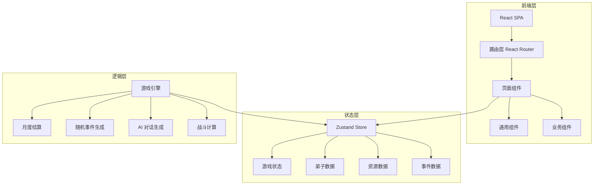
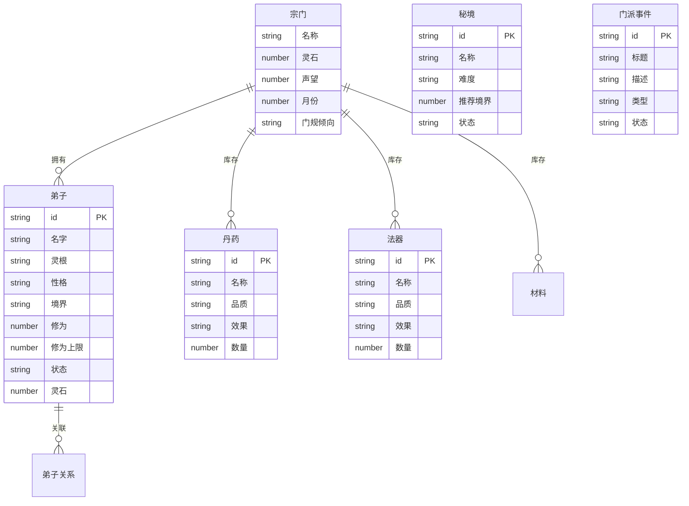

## 1. 架构设计

纯前端架构，所有游戏逻辑在客户端运行，无需后端服务。

## 2. 技术说明

- **前端框架**：React 18 + TypeScript + Vite
- **样式方案**：Tailwind CSS 3 + CSS Variables 主题系统
- **状态管理**：Zustand（全局游戏状态）
- **路由**：React Router DOM v6
- **图表**：纯 CSS/SVG 实现（轻量，无外部依赖）
- **动画**：CSS Animations + Transitions
- **图标**：Lucide React
- **数据持久化**：localStorage（存档功能）
- **后端**：无（纯前端游戏）

## 3. 路由定义

| 路由 | 用途 |
|------|------|
| `/` | 宗门总览页面 |
| `/disciples` | 弟子名册页面 |
| `/cultivation` | 洞府修炼页面 |
| `/expedition` | 秘境探索页面 |
| `/alchemy` | 炼丹炼器页面 |
| `/council` | 门派议事页面 |

## 4. 数据模型

### 4.1 数据模型定义

### 4.2 核心数据结构

**灵根类型**：金、木、水、火、土、冰、雷、风、天灵根、变异灵根

**境界体系**：练气 → 筑基 → 金丹 → 元婴 → 化神 → 合体 → 大乘 → 渡劫

**性格类型**：刚正、阴柔、狂傲、谦逊、多谋、鲁莽、淡泊、执念

**弟子状态**：空闲、闭关、历练、探索、受伤、突破中

**门规倾向**：严苛 ←→ 宽松（0-100 滑块）

**势力关系**：盟友、中立、敌对

## 5. 游戏机制设计

### 5.1 招募系统
- 消耗灵石招募弟子，灵石消耗随弟子数量递增
- 弟子灵根与性格随机生成
- 天灵根/变异灵根概率极低（1%-3%）

### 5.2 修炼系统
- 闭关弟子每月自动增长修为，增长量与灵根资质相关
- 分配灵石可加速修炼（每100灵石+10%效率）
- 修为满后可尝试突破，突破概率与灵根匹配度、资源投入相关
- 突破失败可能走火入魔（受伤状态）

### 5.3 秘境探索
- 秘境有不同难度等级，推荐境界参考
- 组队探索，队长属性影响队伍表现
- 探索中可能遭遇战斗、宝箱、陷阱、奇遇
- 根据队伍实力计算胜率与伤亡概率

### 5.4 炼丹炼器
- 选择配方 + 消耗材料进行炼制
- 成功率受弟子相关属性影响
- 品质随机：下品、中品、上品、极品

### 5.5 AI 对话与事件
- 每月自动生成弟子对话事件（基于性格组合）
- 性格冲突的弟子容易产生争执事件
- 随机门派事件：天灾、外敌入侵、宝物出世、弟子叛变等
- 玩家抉择影响声望与势力关系

### 5.6 月度结算
- 灵石收支（弟子消耗、探索收益、炼丹消耗等）
- 修为增长汇总
- 声望变化
- 伤亡报告
- 势力关系变动
